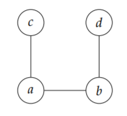
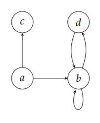

.. dsc40graph documentation master file, created by
   sphinx-quickstart on Thu Nov  7 23:31:53 2019.
   You can adapt this file completely to your liking, but it should at least
   contain the root `toctree` directive.

Welcome to dsc40graph's documentation!
======================================

.. toctree::
   :maxdepth: 3
   :caption: Contents:

.. currentmodule:: dsc40graph

This module provides efficient data structures for representing undirected and
directed graphs.

Installation
============

This module is on PyPI. To install it, simply run the command:

.. code::

    pip install dsc40graph

Alternatively, you may download :code:`dsc40graph.py` from `GitHub <https://raw.githubusercontent.com/eldridgejm/dsc40graph/master/dsc40graph.py>`_
and place it in the same directory as your code.

User Guide
==========

This section of the documentation describes the most common use cases. The next
section lists the objects provided by the module.

Creating graphs
---------------

This module contains two graph classes: :class:`UndirectedGraph` and
:class:`DirectedGraph`. They can be instantiated as follows:

.. doctest::

    >>> import dsc40graph
    >>> graph = dsc40graph.UndirectedGraph()
    >>> digraph = dsc40graph.DirectedGraph()

In what follows we will assume that the above lines have been executed so that
we have two objects: `graph` and `digraph` representing an undirected graph and
a directed graph, respectively.

.. testsetup

    graph = dsc40graph.UndirectedGraph()
    digraph = dsc40graph.DirectedGraph()

Nodes can be created by supplying the new node's label to the
:meth:`UndirectedGraph.add_node` and :meth:`DirectedGraph.add_node` methods.
Valid labels include numbers and strings:

.. doctest::

    >>> graph.add_node(1)
    >>> graph.add_node('foo')

In fact, anything that can be a key in a Python `dict` (i.e., anything
*hashable*) can be a node label. For instance, a tuple of numbers and strings
is hashable and can be a node label:

.. doctest::

    >>> graph.add_node((1, 2, 'hello'))

Edges are added to the graph by supplying the labels of the edge's nodes to the
:meth:`UndirectedGraph.add_edge` and the :meth:`DirectedGraph.add_edge`
methods:

.. doctest::

    >>> graph.add_edge(1, 2)
    >>> digraph.add_edge(1, 2)
    >>> digraph.add_edge(2, 1)

If an edge involves a node which is not in the graph, the node is automatically created:

.. doctest::

    >>> graph.add_edge(1, 42)

Nodes and edges can be removed with the 
:class:`UndirectedGraph.remove_node`,
:class:`UndirectedGraph.remove_edge`,
:class:`DirectedGraph.remove_node`, and
:class:`DirectedGraph.remove_edge` methods.
Any of these methods will raise an exception if the node/edge being removed does not exist.

Example 1: Undirected Graph
^^^^^^^^^^^^^^^^^^^^^^^^^^^

Consider the following undirected graph.

The most basic approach to representing the graph above in code is what follows:

.. doctest::
    
    >>> graph = dsc40graph.UndirectedGraph()
    >>> graph.add_node('a')
    >>> graph.add_node('b')
    >>> graph.add_node('c')
    >>> graph.add_node('d')
    >>> graph.add_edge('a', 'c')
    >>> graph.add_edge('a', 'b')
    >>> graph.add_edge('b', 'd')

Since nodes are automatically created when an edge is added, the same graph
could have been constructed with the following code:

.. doctest::

    >>> graph = dsc40graph.UndirectedGraph()
    >>> graph.add_edge('a', 'c')
    >>> graph.add_edge('a', 'b')
    >>> graph.add_edge('b', 'd')

An approach which is often more concise is to define a list of the edges and
loop over them:

    >>> graph = dsc40graph.UndirectedGraph()
    >>> for u, v in [('a', 'c'), ('a', 'b'), ('b', 'd')]: 
    ...     graph.add_edge(u, v)

Example 2: Directed Graph
^^^^^^^^^^^^^^^^^^^^^^^^^

Consider the following digraph:

The most basic approach to creating this graph is as follows:

.. doctest::

    >>> digraph = dsc40graph.DirectedGraph()
    >>> digraph.add_node('a')
    >>> digraph.add_node('b')
    >>> digraph.add_node('c')
    >>> digraph.add_node('d')
    >>> digraph.add_edge('a', 'c')
    >>> digraph.add_edge('a', 'b')
    >>> digraph.add_edge('b', 'b')
    >>> digraph.add_edge('b', 'd')
    >>> digraph.add_edge('d', 'b')

But because nodes are automatically created when edges are added, we could
accomplish the same result with the following code:

.. doctest::

    >>> digraph = dsc40graph.DirectedGraph()
    >>> for u, v in [('a', 'c'), ('a', 'b'), ('b', 'b'), ('b', 'd'), ('d', 'b')]:
    ...     digraph.add_edge(u, v)

Working with Graphs
-------------------

Suppose the variable :code:`graph` represents the undirected graph shown below:

.. testsetup::

    import dsc40graph
    digraph = dsc40graph.DirectedGraph()
    for u, v in [('a', 'c'), ('a', 'b'), ('b', 'b'), ('b', 'd'), ('d', 'b')]:
        digraph.add_edge(u, v)
    graph = dsc40graph.UndirectedGraph()
    for u, v in [('a', 'c'), ('a', 'b'), ('b', 'd')]: 
        graph.add_edge(u, v)

While the code in this section will deal with the undirected graph above, the
same code will work for directed graphs.

Questions about the nodes in the graph can be answered by interacting with the :code:`graph.nodes`
attribute. For instance, to get the number of nodes:

.. doctest::

    >>> len(graph.nodes)
    4

To check if a node with a certain label exists:

.. doctest::

    >>> 'a' in graph.nodes
    True
    >>> 'foo' in graph.nodes
    False

Similarly, questions about the edges of a graph are answered using the :code:`graph.edges` attribute.
For example, the number of edges is found by writing:

.. doctest::

    >>> len(graph.edges)
    3

To query for the existence of an edge:

.. doctest::

    >>> ('a', 'b') in graph.edges
    True
    >>> ('b', 'a') in graph.edges
    True
    >>> ('a', 'foo') in graph.edges
    False

The :meth:`UndirectedGraph.neighbors` method returns the neighbors of a node:

.. doctest::

    >>> graph.neighbors('a')
    {'c', 'b'}

Do not modify this set! It is a view of the internal representation of the graph.

In addition to having a :code:`.neighbors()` method, directed graphs have
:meth:`DirectedGraph.predecessors` and :meth:`DirectedGraph.successors`
methods. The :meth:`DirectedGraph.neighbors` method is an alias of
:meth:`DirectedGraph.successors`.

API
===

Classes
-------

.. autoclass:: UndirectedGraph

    .. attribute:: nodes

        A view of the graph's nodes. The number of nodes can be found by writing:

            >>> len(graph.nodes)

        A query for the node with label 'u' can be performed by writing:

            >>> 'u' in graph.nodes

    .. attribute:: edges

        A view of the graph's edges. The number of edges can be retrieved by writing:

            >>> len(graph.edges)

        A query for the edge with labels 'u' and 'v' can be performed by writing:

            >>> ('u', 'v') in graph.edges

        Since edges have no orientation in an undirected graph, the order of
        the nodes in the query does not matter. That is, the above is equivalent to:

            >>> ('v', 'u') in graph.edges

    .. automethod:: add_node
    .. automethod:: remove_node
    .. automethod:: arbitrary_node
    .. automethod:: add_edge
    .. automethod:: remove_edge
    .. automethod:: neighbors

.. autoclass:: DirectedGraph

    .. attribute:: nodes

        A view of the graph's nodes. The number of nodes can be found by writing:

            >>> len(graph.nodes)

        A query for the node with label 'u' can be performed by writing:

            >>> 'u' in graph.nodes

    .. attribute:: edges

        A view of the graph's edges. The number of edges can be retrieved by writing:

            >>> len(graph.edges)

        A query for the edge with labels 'u' and 'v' can be performed by writing:

            >>> ('u', 'v') in graph.edges

    .. automethod:: add_node
    .. automethod:: remove_node
    .. automethod:: arbitrary_node
    .. automethod:: add_edge
    .. automethod:: remove_edge
    .. automethod:: predecessors
    .. automethod:: successors
    .. automethod:: neighbors

Exceptions
----------

.. autoclass:: Error
.. autoclass:: DoesNotExistError

Indices and tables
==================

* :ref:`genindex`
* :ref:`modindex`
* :ref:`search`
